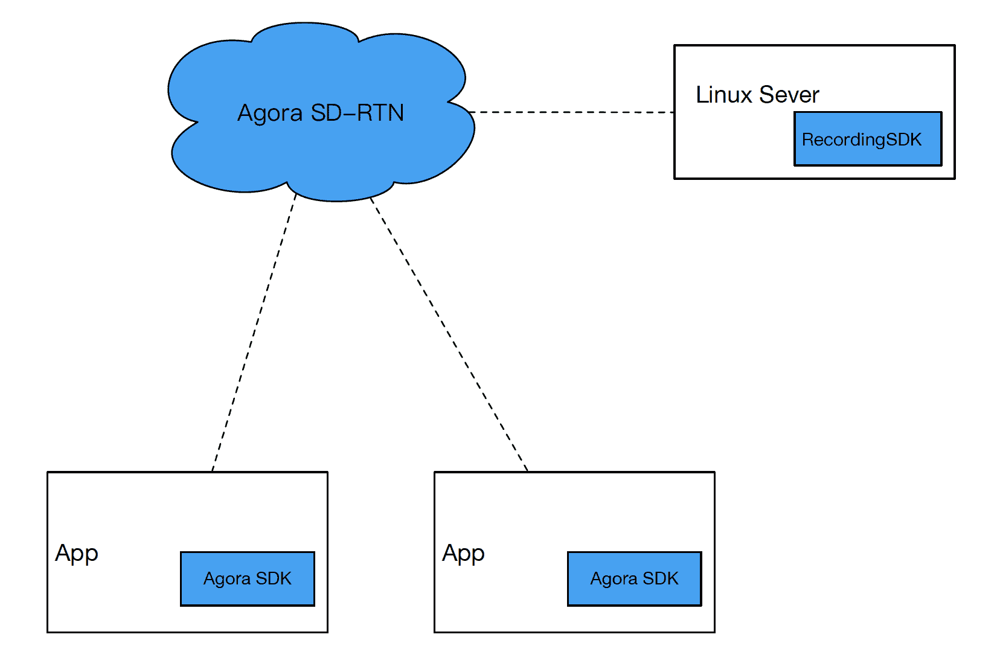
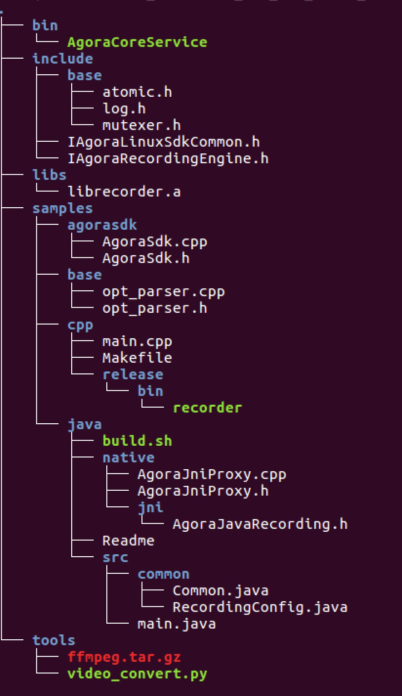

# Agora Linux Server Recording

This sample application for the Agora Recording SDK enables recording on your Linux server.

## Introduction

The Agora Recording SDK for Linux is integrated on your Linux server instead of your app:

 <div></div>

To record the content of a channel, a ‘special audience’ joins the channel, gets the content and stores the content on a Linux server. You must:

-   Implement the recording SDK on your Linux server;
-   Use the same App ID in the recording SDK and in other Agora SDKs implementing voice or video communication.
-   Specify the channel to record.

## Prerequisites
### Hardware and Network prerequisites

You must meet the following hardware and network prerequisites:

<table>
  <tr>
    <th>Hardware</th>
    <th>Requirements</th>
  </tr>
  <tr>
    <td>Server</td>
    <td>Physical or virtual:
      <ul>
        <li>Ubuntu Linux 14.04+ LTS 64-bit;</li>
        <li>CentOS 7+ x64</li>
      </ul>
    </td>
  </tr>
  <tr>
    <td>Network</td>
    <td>The Linux server needs Internet access</td>
  </tr>
  <tr>
    <td>Internet Bandwidth</td>
    <td>Decide the Internet bandwidth based on the number of channels being recorded simultaneously. Refer to the following data: 
      <ul>
        <li>When the resolution of the recorded scene is 640*360, the bandwidth is 500kbps;</li>
        <li>To record a channel with two users, you need a bandwidth of 1 Mbps;</li>
        <li>For 100 channels, you need a bandwidth of 100Mbps.</li>
      </ul>
    </td>
  </tr>
  <tr>
    <td>DNS</td>
    <td>The Linux server needs Internet access</td>
  </tr>

Agora recommends the following hardware configurattions:

<table>
  <tr>
    <th>Product</th>
    <th>Description</th>
    <th>Number</th>
  </tr>
  <tr>
    <td>SUPERMICRO SYS-6017R-TDF</td>
    <td>1U rack-mounted SYS-6017R-TDF</td>
    <td>1</td>
  </tr>
  <tr>
    <td></td>
    <td>Intel® Xeon® E5-2600 Series Processor</td>
    <td></td>
  </tr>
  <tr>
    <td>Case</td>
    <td>1U Rackmountable</td>
    <td>1</td>
  </tr>
  <tr>
    <td></td>
    <td>(440-W high-efficiency redundant power supply w/ PMBus)</td>
    <td></td>
  </tr>
  <tr>
    <td>Processor</td>
    <td>Intel Xeon E5-2620V2 2.1 G, L3:15M, 6C (P4X-DPE52620V2-SR1AN)</td>
    <td>2</td>
  </tr>
  <tr>
    <td>Memory</td>
    <td>MEM-DR380L-HL06-ER16 (8-GB DDR3-1600 2Rx8 1.35-V ECC REG RoHS)</td>
    <td>1</td>
  </tr>
  <tr>
    <td>Hard Disk</td>
    <td>250-G 3.5 SATA Enterprise (HDD-T0250-WD2503ABYZ)</td>
    <td>2</td>
  </tr>
</table>

Assuming two users are in a channel in a video call \(communication mode\), with the resolution of 640\*360, frame rate of 15 fps and bitrate of one video stream of 500kbps:

The CPU is fully loaded and 100 channels are recorded simultaneously:

  -   Each channel writes to the disk at a speed of 60 kB/s. The total write-in speed is 6.0 MB/s, which is much lower than the maximum write-in speed of the disk;
  -   Each channel uses 25 MB of memory. Thus, 2.5 GB of memory, which is 31% of the total memory, is taken;
  -   The downstream Internet flow for each channel is 500 kbps \* 2 = 1 Mbps. The total downstream flow is 100 Mbps. The upstream flow is neglected.

### Compatibility with the Agora SDKs

The recording SDK supports:

  -   recording the communication that uses the native SDK;
  -   recording the communication that uses the web SDK;
  -   recording the communication that uses both the native SDK and the web SDK;

The recording SDK is compatible with the following Agora SDKs:

  -   Agora Native SDK v1.7.0+ for all platforms. If any user in the channel uses Agora SDK v1.6, the whole channel cannot record anything;
  -   Agora Web SDK v1.12.0+ .

## Steps to Run the Sample 

### Step 1: Setting up the environment
1.  Get the channel name and App ID of the communication that you want to record.
2.  [Download](https://docs.agora.io/en/2.3.1/download)
 
 <div></div>
 
  <table>
    <tbody>
      <tr>
        <td><strong>Folder</strong></td>
        <td><strong>Description</strong></td>
      </tr>
      <tr>
        <td>bin</td>
        <td>The directory where AgoraCoreService is located</td>
      </tr>
      <tr>
        <td>include</td>
        <td>
          <ul class="first last simple">
            <li>base: Required header files for developing the recording application</li>
            <li>IAgoraLinuxSdkCommon.h: Public structure and enumeration</li>
            <li>IAgoraRecordingEngine.h: Interface of the recording engine and its config information</li>
          </ul>
        </td>
      </tr>
      <tr>
        <td>libs</td>
        <td>Required libraries for developing the recording application</td>
      </tr>
      <tr>
        <td>samples</td>
        <td>Sample code
          <ul class="last simple">
            <li>agorasdk: Demo that implements the C++ interface and callbacks</li>
            <li>base: Public sample code</li>
            <li>cpp: C++ sample code
              <ul>
                <li>release/bin/recorder: Parent process that can be run</li>
              </ul>
            </li>
            <li>java: Java sample code
              <ul>
                <li>native: Native code</li>
                <li>native/jni: JNI delegate</li>
                <li>src: java code</li>
                <li>src/io/agora/recording/RecordingEventHandler.java: Callback interface class</li>
                <li>src/io/agora/recording/RecordingSDK.java: Recording interface class</li>
              </ul>
            </li>
          </ul>
        </td>
      </tr>
      <tr>
        <td>Tools</td>
        <td>Transcoding tools</td>
      </tr>
    </tbody>
  </table>

3.  Open the TCP ports 1080 and 8000.
4.  Open the UDP ports:

    -   Duplex ports: 1080, 4000-4030, 8000, 9700 and 25000;
    -   Simplex downstream ports used by the recording processes.

    **Note:** 

      -   Use the command line *iptables -L* to check the UDP port.
      -   To record the content in channels, you need one recording process for each of the channels. One recording process requires four simplex downstream ports. There must be no port conflict among the processes, including the system processes and all the recording processes.
          -   Agora recommends that you specify the range of ports used by the recording processes. Configure a large range for all recording processes \(Agora recommends 40000 ~ 41000 or larger\). If so, the Recording SDK assigns ports to each recording process within the specified range and avoids port conflicts automatically. To set the port range, you need to configure the parameters *lowUdpPort* and *highUdpPort*;
          -   If the parameters, *lowUdpPort* and *highUdpPort*, are not specified, the ports used by the recording processes are at random, which may cause port conflicts.

5.  Set whitelist domains: *.agora.io*, *vocs.agora.io*, *qoslbs.agora.io*, and *qos.agora.io* .
6.  Ensure that your compiler is gcc 4.4+.

### Step 2: Compiling the Sample Code

To compile the sample code under the *samples/cpp* directory, run the following command:

```
make
```

After the compilation, a *record\_local* application is generated in the directory.

### Step 3: Starting Recording

Start recording.

Under the *samples/cpp* directory, run the following command:

```
./recorder_local --appId APP_ID --uid 0 --channel Channel_Name --appliteDir ../../bin
```

**Note:** 

-   Replace *APP\_ID* with the App ID used in communication;
-   Replace *Channel\_Name* with the channel name of the channel to record.


The command specifies the following information:

-   –appId APP\_ID specifies the App ID used in communication to record;
-   –uid 0 allows the SDK to automatically assign a uid for recording;
-   –channel Channel\_Name specifies the name of the channel to record;
-   –appliteDir ../../bin specifies the directory of AgoraCoreService.

After you start recording, you can find folders with a name convention of *date\_timestamp* under the directory of *samples/cpp*.

You can also develop C++ programs to implement recording apart from using command line.

For the detailed API reference, see [Recording API](https://docs.agora.io/en/2.3.1/addons/Recording/API%20Reference/recording_cpp). You can also run *./record\_local* command for details.

## Steps to Create the Sample

The key code for the sample application is in the `main.cpp` file. The most relevant code for the Agora Recording SDK is in the following sections:

- [Import C++ Libraries](#import_c++_libraries)
- [Add Namespaces and Global Variables](#add-namespaces-and-global-variables)
- [Create the Start and Stop Service Methods](#create-the-start-and-stop-service-methods)
- [Create the Main Method](#create-the-main-method)

### Import C++ Libraries

Import the C++ libraries for variable definitions and streaming.

Library|Description
----|----
`<csignal>`|Signal handling library
`<cstdint>`|Defines a set of integral type aliases
`<iostream>`|Defines the standard input/output stream objects
`<sstream>`|Provides string stream classes
`<string>`|Defines string types, character traits, and a set of converting functions
`<vector>`|Defines the vector container class
`<algorithm>`|Defines a collection of functions designed to be used on ranges of elements

``` c++
#include <csignal>
#include <cstdint>
#include <iostream>
#include <sstream> 
#include <string>
#include <vector>
#include <algorithm>
```

Import the Agora SDK libraries.

Library|Description
----|----
`IAgoraLinuxSdkCommon.h`|Defines Agora variable types and classes
`IAgoraRecordingEngine.h`|Defines the Agora recording engine class
`base/atomic.h`|Defines the Agora namespace
`base/log.h`|Agora logging library
`base/opt_parser.h`|Agora communication helper library
`agorasdk/AgoraSdk.h`|Agora Recording SDK

``` c++
#include "IAgoraLinuxSdkCommon.h"
#include "IAgoraRecordingEngine.h"

#include "base/atomic.h"
#include "base/log.h" 
#include "base/opt_parser.h" 
#include "agorasdk/AgoraSdk.h" 
```

### Add Namespaces and Global Variables

Define standard and Agora classes, and specify namespaces to use in the code.

``` c++
using std::string;
using std::cout;
using std::cerr;
using std::endl;

using agora::base::opt_parser;
using agora::linuxsdk::VideoFrame;
using agora::linuxsdk::AudioFrame;

```

Define global variables to determine service status.

Variable|Description
---|---
`g_bSignalStop`|Used to define if a signal is stopped
`g_bSignalStartService`|Used to define if a service has started
`g_bSignalStopService`|Used to define if a service has stopped


``` c++
atomic_bool_t g_bSignalStop;
atomic_bool_t g_bSignalStartService;
atomic_bool_t g_bSignalStopService;
```

### Create the Start and Stop Service Methods

The `start_service()` and `stop_service()` methods update the global `g_bSignalStartService` and `g_bSignalStopService` variables.

``` c++
void start_service(int signo) {
    (void)signo;
    g_bSignalStartService = true;
}

void stop_service(int signo) {
    (void)signo;
    g_bSignalStopService = true;
}
```

### Create the Main Method

The `main()` function is called when the application initializes.

``` c++
int main(int argc, char * const argv[]) {
  
  ...
  
}
```

- [Define Variables](#define-variables)
- [Set the Signal Event Handlers](#set-the-signal-event-handlers)
- [Set Up the Parser Object](#set-up-the-parser-object)
- [Check Configuration Settings](#check-configuration-settings)
- [Set the Recording Configuration](#set-the-recording-configuration)
- [Set Up the Agora Recorder](#set-up-the-agora-recorder)

#### Define Variables

##### Define Agora variables for the Agora SDK engine.

Variable|Description
----|----
`uid`|User ID
`appId`|App ID
`channelKey`|Channel key
`name`|Channel name
`channelProfile`|Channel profile

``` c++
  uint32_t uid = 0;
  string appId;
  string channelKey;
  string name;
  uint32_t channelProfile = 0;
```
##### Define variables for recording configrations.

Define the decryption mode `decryptionMode` and decryption key `secret`.

``` c++
  string decryptionMode;
  string secret;
```

Define the resolution for the video mix and the idle time limit (in seconds).

``` c++
  string mixResolution("360,640,15,500");

  int idleLimitSec=5*60;//300s
```

Define the paths for the application.

Variable|Description
---|---
`applitePath`|Path to store AgoraCoreService
`recordFileRootDir`|Directory to save the recording files
`cfgFilePath`|Path to the configuration file
`proxyServer`|IP and port for the proxy server

``` c++
  string applitePath;
  string appliteLogPath;
  string recordFileRootDir = "";
  string cfgFilePath = "";
  string proxyServer;
```

Define the variables for the low and high UDP ports.

``` c++
  int lowUdpPort = 0;//40000;
  int highUdpPort = 0;//40004;
```

Define the audio, video, and mixing variables for the settings in the Agora parser.

``` c++
  bool isAudioOnly=0;
  bool isVideoOnly=0;
  bool isMixingEnabled=0;
  bool mixedVideoAudio=0;
```

Define the audio, video, and stream format types.

``` c++
  uint32_t getAudioFrame = agora::linuxsdk::AUDIO_FORMAT_DEFAULT_TYPE;
  uint32_t getVideoFrame = agora::linuxsdk::VIDEO_FORMAT_DEFAULT_TYPE;
  uint32_t streamType = agora::linuxsdk::REMOTE_VIDEO_STREAM_HIGH;
```

Define the video snapshot interval `captureInterval` (in seconds). Set the trigger mode to automatic.

``` c++
  int captureInterval = 5;
  int triggerMode = agora::linuxsdk::AUTOMATICALLY_MODE;
```

Define the following video parameters: width, height, framerate, and bitrate.

``` c++
  int width = 0;
  int height = 0;
  int fps = 0;
  int kbps = 0;
```

Define signal variables, which track the communication signal of the recording.

``` c++
  g_bSignalStop = false;
  g_bSignalStartService = false;
  g_bSignalStopService = false;
```

#### Set the Signal Event Handlers

Use the `signal()` method to set signal event handlers.

Event|Description
---|---
`SIGQUIT`|The signal is terminated.
`SIGABRT`|The signal is aborted.
`SIGINT`|The signal is interrupted.
`SIGPIPE`|Broken pipe signal. Passing `SIG_IGN` as a handler ignores the broken pipe signal.

``` c++
  signal(SIGQUIT, signal_handler);
  signal(SIGABRT, signal_handler);
  signal(SIGINT, signal_handler);
  signal(SIGPIPE, SIG_IGN);
```

#### Set Up the Parser Object

Define the `parser` object, using the `parser.add_long_opt()` method to parse the following rtcEngine parameters:
	
- app ID
- user ID
- channel name
- application path
- channel key
- channel profile

``` c++
  opt_parser parser;

  parser.add_long_opt("appId", &appId, "App Id/must", agora::base::opt_parser::require_argu);
  parser.add_long_opt("uid", &uid, "User Id default is 0/must", agora::base::opt_parser::require_argu);

  parser.add_long_opt("channel", &name, "Channel Id/must", agora::base::opt_parser::require_argu);
  parser.add_long_opt("appliteDir", &applitePath, "directory of app lite 'AgoraCoreService', Must pointer to 'Agora_Recording_SDK_for_Linux_FULL/bin/' folder/must",
          agora::base::opt_parser::require_argu);

  parser.add_long_opt("channelKey", &channelKey, "channelKey/option");
  parser.add_long_opt("channelProfile", &channelProfile, "channel_profile:(0:COMMUNICATION),(1:broadcast) default is 0/option");
```

Parse the audio, video, and mix settings.

``` c++
  parser.add_long_opt("isAudioOnly", &isAudioOnly, "Default 0:A/V, 1:AudioOnly (0:1)/option");
  parser.add_long_opt("isVideoOnly", &isVideoOnly, "Default 0:A/V, 1:VideoOnly (0:1)/option");
  parser.add_long_opt("isMixingEnabled", &isMixingEnabled, "Mixing Enable? (0:1)/option");
  parser.add_long_opt("mixResolution", &mixResolution, "change default resolution for vdieo mix mode/option");
  parser.add_long_opt("mixedVideoAudio", &mixedVideoAudio, "mixVideoAudio:(0:seperated Audio,Video) (1:mixed Audio & Video), default is 0 /option");
```

Parse the decryption mode and decryption key `secret`.

``` c++
  parser.add_long_opt("decryptionMode", &decryptionMode, "decryption Mode, default is NULL/option");
  parser.add_long_opt("secret", &secret, "input secret when enable decryptionMode/option");
```

Parse the idle time limit and root directory for the recording files.

``` c++
  parser.add_long_opt("idle", &idleLimitSec, "Default 300s, should be above 3s/option");
  parser.add_long_opt("recordFileRootDir", &recordFileRootDir, "recording file root dir/option");
```

Parse the low and high UDP ports.

``` c++
  parser.add_long_opt("lowUdpPort", &lowUdpPort, "default is random value/option");
  parser.add_long_opt("highUdpPort", &highUdpPort, "default is random value/option");
```

Parse the audio and video frame settings.

``` c++
  parser.add_long_opt("getAudioFrame", &getAudioFrame, "default 0 (0:save as file, 1:aac frame, 2:pcm frame, 3:mixed pcm frame) (Can't combine with isMixingEnabled) /option");
  parser.add_long_opt("getVideoFrame", &getVideoFrame, "default 0 (0:save as file, 1:h.264, 2:yuv, 3:jpg buffer, 4:jpg file, 5:jpg file and video file) (Can't combine with isMixingEnabled) /option");
```

Parse the video snapshot interval, configuration file path, and proxy server.

``` c++
  parser.add_long_opt("captureInterval", &captureInterval, "default 5 (Video snapshot interval (second))");
  parser.add_long_opt("cfgFilePath", &cfgFilePath, "config file path / option");
  parser.add_long_opt("proxyServer", &proxyServer, "proxyServer:format ip:port, eg,\"127.0.0.1:1080\"/option");
```

Parse the video stream type and trigger mode.

``` c++
  parser.add_long_opt("streamType", &streamType, "remote video stream type(0:STREAM_HIGH,1:STREAM_LOW), default is 0/option");
  parser.add_long_opt("triggerMode", &triggerMode, "triggerMode:(0: automatically mode, 1: manually mode) default is 0/option");
```

#### Check Configuration Settings

Ensure the `parser` settings, `appID`, and channel `name` are all valid. If any of these are invalid, terminate the application.

``` c++
  if (!parser.parse_opts(argc, argv) || appId.empty() || name.empty()) {
    std::ostringstream sout;
    parser.print_usage(argv[0], sout);
    cout<<sout.str()<<endl;
    return -1;
  }
```

If the trigger mode is set to manual, add additional signal event listeners to start and stop the service.
 
``` c++
  if(triggerMode == agora::linuxsdk::MANUALLY_MODE) {
      signal(SIGUSR1, start_service);
      signal(SIGUSR2, stop_service);
  }
```

Check if the recording file directory and configuration file path are empty. If the directories are not empty, log an error using the `LOG()` method and terminate the application.


``` c++
  if(!recordFileRootDir.empty() && !cfgFilePath.empty()){
    LOG(ERROR,"Client can't set both recordFileRootDir and cfgFilePath");
    return -1;
  }
```

If the directories are empty and mixing is enabled, set the video parameters. If the parameters are invalid, terminate the application.

``` c++
  if(recordFileRootDir.empty() && cfgFilePath.empty())
      recordFileRootDir = ".";

  //Once recording video under video mixing model, client needs to config width, height, fps and kbps
  if(isMixingEnabled && !isAudioOnly) {
     if(4 != sscanf(mixResolution.c_str(), "%d,%d,%d,%d", &width,
                  &height, &fps, &kbps)) {
        LOG(ERROR, "Illegal resolution: %s", mixResolution.c_str());
        return -1;
     }
  }
```

#### Apply the Recording Configuration

Add a log to track the users that join the channel.

``` c++
  LOG(INFO, "uid %" PRIu32 " from vendor %s is joining channel %s",
          uid, appId.c_str(), name.c_str());
          
  agora::AgoraSdk recorder;
  agora::recording::RecordingConfig config;
```

Define the Agora SDK `recorder` and configuration.

``` c++
  agora::AgoraSdk recorder;
  agora::recording::RecordingConfig config;
```

Apply the idle time limit and channel profile.

``` c++
  config.idleLimitSec = idleLimitSec;
  config.channelProfile = static_cast<agora::linuxsdk::CHANNEL_PROFILE_TYPE>(channelProfile);
```

Apply the video, audio, and mix settings.
  
``` c++
  config.isVideoOnly = isVideoOnly;
  config.isAudioOnly = isAudioOnly;
  config.isMixingEnabled = isMixingEnabled;
  config.mixResolution = (isMixingEnabled && !isAudioOnly)? const_cast<char*>(mixResolution.c_str()):NULL;
  config.mixedVideoAudio = mixedVideoAudio;
```

Apply the application directory, recording file directory, configuration file path, and proxy server.

``` c++
  config.appliteDir = const_cast<char*>(applitePath.c_str());
  config.recordFileRootDir = const_cast<char*>(recordFileRootDir.c_str());
  config.cfgFilePath = const_cast<char*>(cfgFilePath.c_str());
  config.proxyServer = proxyServer.empty()? NULL:const_cast<char*>(proxyServer.c_str());
```

Apply the decryption mode and decryption key `secret`.

``` c++
  config.secret = secret.empty()? NULL:const_cast<char*>(secret.c_str());
  config.decryptionMode = decryptionMode.empty()? NULL:const_cast<char*>(decryptionMode.c_str());
```

Apply the low and high UDP ports and the video capture interval.

``` c++
  config.lowUdpPort = lowUdpPort;
  config.highUdpPort = highUdpPort;
  config.captureInterval = captureInterval;
```

Apply the audio, video, and stream format types and the trigger mode.

``` c++
  config.decodeAudio = static_cast<agora::linuxsdk::AUDIO_FORMAT_TYPE>(getAudioFrame);
  config.decodeVideo = static_cast<agora::linuxsdk::VIDEO_FORMAT_TYPE>(getVideoFrame);
  config.streamType = static_cast<agora::linuxsdk::REMOTE_VIDEO_STREAM_TYPE>(streamType);
  config.triggerMode = static_cast<agora::linuxsdk::TRIGGER_MODE_TYPE>(triggerMode);
```

#### Set Up the Agora Recorder

Set the mix mode for the `recorder`.

``` c++
  recorder.updateMixModeSetting(width, height, isMixingEnabled ? !isAudioOnly:false);
```

Create an Agora video channel. If it fails, terminate the application.

``` c++
  if (!recorder.createChannel(appId, channelKey, name, uid, config)) {
    cerr << "Failed to create agora channel: " << name << endl;
    return -1;
  }
```

Update the recording storage directory.

``` c++
  cout << "Recording directory is " << recorder.getRecorderProperties()->storageDir << endl;
  recorder.updateStorageDir(recorder.getRecorderProperties()->storageDir);
```

While the `recorder` is running, update the signal service using `recorder.startService()` and `recorder.stopService()`.

``` c++
  while (!recorder.stopped() && !g_bSignalStop) {
      if(g_bSignalStartService) {
          recorder.startService();
          g_bSignalStartService = false;
      }

      if(g_bSignalStopService) {
          recorder.stopService();
          g_bSignalStopService = false;
      }

      sleep(1);
  }
```

Once the signal stops, leave the channel using `recorder.leaveChannel()` and release the `recorder` object.

``` c++
  if (g_bSignalStop) {
    recorder.leaveChannel();
    recorder.release();
  }

  cerr << "Stopped \n";
  return 0;
```

## Resources
- See full API documentation in the [Document Center](https://docs.agora.io/en/)
- [File bugs about this sample](https://dashboard.agora.io)
- See [detailed Agora Linux Recording guides](https://docs.agora.io/en/2.3.1/addons/Recording/Quickstart%20Guide/recording_cpp?platform=C%2B%2B)

## License
This software is licensed under the MIT License (MIT). [View the license](LICENSE.md).