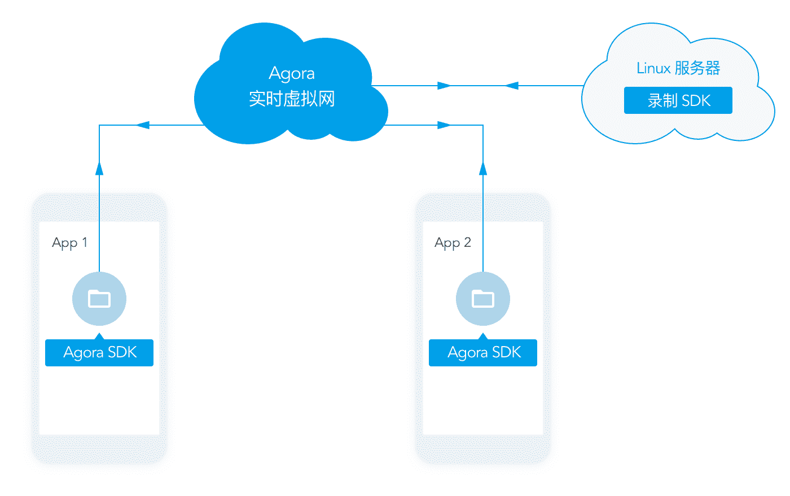
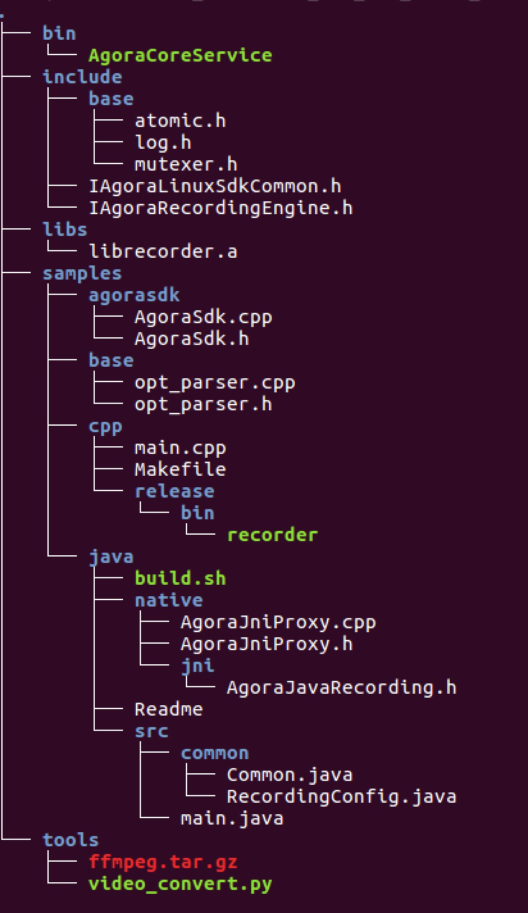

# Agora 服务端录制

本示例代码使用 Agora Recording SDK for Linux 实现语音或视频通话的服务端录制。

## 简介

Agora Recording SDK for Linux 集成在你的 Linux 服务器而非 App 上。

 <div></div>

录制某频道内的音视频信息相当于将一个特殊的观众加入该频道。该观众获取频道内的音视频信息，将获取到的信息转码并储存在 Linux 服务器上。
因此，你必须：

-   将录制 SDK 集成在你的 Linux 服务器上；
-   在录制 SDK 中和进行音视频通话的其他声网 SDK 中使用同一个 APP ID 。
-   指定希望录制的频道。

## 环境配置
### 硬件配置

<table>
  <tr>
    <th>硬件</th>
    <th>要求</th>
  </tr>
  <tr>
    <td>服务器</td>
    <td>物理或虚拟</td>
  </tr>
  <tr>
  	<td>系统</td>
  	<td>Ubuntu Linux 14.04+ LTS 64-bit 或 CentOS 7+ x64</td>
   </tr>
  <tr>
    <td>网络</td>
    <td>这台 Linux 服务器要接入公网，有公网 IP</td>
  </tr>
  <tr>
    <td>网络接入带宽</td>
    <td>根据需要同时录制的频道数量和频道内情况确定所需带宽。以下数据可供参考：录制一个分辨率为 640*480 的画面需要的带宽约为 500kbps；录制一个有两个人的频道则需 1Mbps；同时录制 100 个这样的频道，需要带宽为 100Mbps。</td>
  </tr>
  <tr>
    <td>域名解析</td>
    <td>服务器允许访问 qos.agoralab.co，否则 SDK 无法上报必要的统计数据。</td>
  </tr>
 </table>

参考硬件配置：

<table>
  <tr>
    <th>产品</th>
    <th>描述</th>
    <th>数量</th>
  </tr>
  <tr>
    <td>SUPERMICRO SYS-6017R-TDF</td>
    <td>1U rack-mounted SYS-6017R-TDF (Intel® Xeon® E5-2600 Series Processor)</td>
    <td>1</td>
  </tr>
  <tr>
    <td>机箱</td>
    <td>1U Rackmountable (440-W high-efficiency redundant power supply w/ PMBus)</td>
    <td>1</td>
  </tr>
  <tr>
    <td>处理器</td>
    <td>Intel Xeon E5-2620V2 2.1 G, L3:15M, 6C (P4X-DPE52620V2-SR1AN)</td>
    <td>2</td>
  </tr>
  <tr>
    <td>内存</td>
    <td>MEM-DR380L-HL06-ER16 (8-GB DDR3-1600 2Rx8 1.35-V ECC REG RoHS)</td>
    <td>1</td>
  </tr>
  <tr>
    <td>硬盘</td>
    <td>250-G 3.5 SATA Enterprise (HDD-T0250-WD2503ABYZ)</td>
    <td>2</td>
  </tr>
</table>

假设每个频道内有两个人进行视频通话（通信模式），分辨率是 640*480 ，帧率为 15fps ，单流码率为 500kbps ：
实测在参考硬件配置下， 12 核 24 线程的 CPU 满载并发 100 个频道，此时：

  -   每个频道占用约 25M 内存；总共占用约 2.5G 内存。内存占用率约为 31%；
  -   每个频道写入磁盘的速度约为 60kB/s ；总写入速度约为 6.0MB/s ，远低于磁盘的最大写入速度；
  -   每个频道下行网络流量约为 500kbps * 2 = 1Mbps ，总下行流量约为 100 Mbps ，上行流量可以忽略不计。

### SDK 兼容性

录制 SDK 支持：

  -   纯 Native 端录制；
  -   纯 Web 端录制；
  -   Web 与 Native 互通时录制。

录制 SDK 与以下 SDK 兼容:

  -   Agora Native SDK v1.7.0+.
  -   Agora Web SDK v1.12.0+ .

**Note:** 

      一旦有人在频道中使用了不兼容的 SDK ，则整个频道都无法录制。

## 示例代码运行步骤

### 步骤 1: 准备环境
1.  获取正在进行通信或直播的频道名和使用的 APP ID。
2.  下载 [Agora recording SDK 及示例代码](https://docs.agora.io/en/2.3.1/download).
 
 <div></div>
 
  <table>
    <tbody>
      <tr>
        <td><strong>文件夹</strong></td>
        <td><strong>描述</strong></td>
      </tr>
      <tr>
        <td>bin</td>
        <td>AgoraCoreService 所在的目录</td>
      </tr>
      <tr>
        <td>include</td>
        <td>
          <ul>
            <li>base: libs 所依赖的一些基础的头文件</li>
            <li>IAgoraLinuxSdkCommon.h: 公共的基础结构体和枚举值</li>
            <li>IAgoraRecordingEngine.h: 录制引擎的接口类和配置信息</li>
          </ul>
        </td>
      </tr>
      <tr>
        <td>libs</td>
        <td>录制的依赖库</td>
      </tr>
      <tr>
        <td>samples</td>
        <td>示例代码
          <ul>
            <li>agorasdk: 对录制 C++ 接口的实现以及回调的处理示例</li>
            <li>base: 公共的示例代码</li>
            <li>cpp: C++ 示例代码
              <ul>
                <li>release/bin/recorder: 可运行的父程序</li>
              </ul>
            </li>
            <li>java: java 示例代码
              <ul>
                <li>native: Native code</li>
                <li>native/jni: JNI 代理</li>
                <li>src: java 代码</li>
                <li>src/io/agora/recording/RecordingEventHandler.java: 回调接口类</li>
                <li>src/io/agora/recording/RecordingSDK.java: 录制接口类</li>
              </ul>
            </li>
          </ul>
        </td>
      </tr>
      <tr>
        <td>Tools</td>
        <td>转码工具</td>
      </tr>
    </tbody>
  </table>

3.  打开 TCP 端口：1080、8000
4.  打开 UDP 端口：双向 1080、4000-4030、8000、9700、25000 和 所有的录制进程所使用的单向下行端口

    **Note:** 

      -   录制一个频道的内容需要开启一个对应的录制进程；单个录制进程需要使用 4 个单向下行端口。进程（包括各个录制进程和系统进程）之间不得有端口冲突。

      	- Agora 建议您指定录制进程使用端口的范围。您可以为多个录制进程统一配置较大的端口范围（Agora 建议 40000 ~ 41000 或更大）。此时，录制 SDK 会在指定范围内为每个录制进程分配端口，并避免端口的冲突。要设置端口范围，您需要配置参数 lowUdpPort 和 highUdpPort；
        - 如果不指定参数 lowUdpPort 和 highUdpPort ，录制进程所使用的端口为随机端口，会有端口冲突的风险。

	  -   查看 UDP 端口时可以使用 iptables -L 命令

5.  将域名 .agora.io、vocs.agora.io、qoslbs.agora.io、qos.agora.io 设为白名单；
6.  安装编译器: gcc 4.4+ ；
7.  如果你希望使用 java 编写录制的程序，请确保您已配置好 JDK 环境。

### 步骤 2: 编译代码示例

在 *samples/cpp* 的目录下进行编译，执行以下命令：

```
make
```

编译完成后，同目录下会生成一个名为 *record\_local* 的可执行程序。

### 步骤 3: 演示录制

在 *samples/cpp* 的目录下，执行以下命令：

```
./recorder_local --appId APP_ID --uid 0 --channel Channel_Name --appliteDir ../../bin
```

**Note:** 

-   请用你在音视频通话中使用的 APP ID 替换命令中的 APP_ID ；
-   请用希望录制的频道名替换命令中的 Channel_Name 。

此命令包含了以下信息：

-   –appId APP\_ID 指定了使用的 APP ID；
-   –uid 0 由 SDK 为录制分配 uid；
-   –channel Channel\_Name 指明了录制的频道名；
-   –appliteDir ../../bin 指明了 AgoraCoreService 所在的目录。

开始录制后，你可以在 *samples/cpp* 目录下找到以 *日期\_时间戳* 命名的录制文件夹。其中， 时间戳 是录制开始的时间。

要查看详细的 API 调用参考，请前往 [Recording API](https://docs.agora.io/en/2.3.1/addons/Recording/API%20Reference/recording_cpp). 你也可以执行 *./record\_local* 命令, 查看相关用法。

## 编写示例代码的步骤

示例代码的核心部分是 `main.cpp`. 我们从以下四个步骤讲述示例代码的编写步骤：

- [加载 C++ 库](#加载_C++_库)
- [定义命名空间和全局变量](#定义命名空间和全局变量)
- [编写开始和结束录制的方法](#编写开始和结束录制的方法)
- [编写 main 方法](#编写_main_方法)

### 加载 C++ 库

加载标准库：

	- <csignal>
	- <cstdint>
	- <iostream>
	- <sstream>
	- <string>
	- <vector>
	- <algorithm>

``` c++
#include <csignal>
#include <cstdint>
#include <iostream>
#include <sstream> 
#include <string>
#include <vector>
#include <algorithm>
```

加载 Agora SDK 库：

库|用途
----|----
`IAgoraLinuxSdkCommon.h`|包含 Agora 定义的变量和类
`IAgoraRecordingEngine.h`|定义了 Agora 录制引擎类
`base/atomic.h`|定义了 Agora 命名空间
`base/log.h`|定义了 Agora log 类
`base/opt_parser.h`|语法解析
`agorasdk/AgoraSdk.h`|Agora Recording SDK

``` c++
#include "IAgoraLinuxSdkCommon.h"
#include "IAgoraRecordingEngine.h"

#include "base/atomic.h"
#include "base/log.h" 
#include "base/opt_parser.h" 
#include "agorasdk/AgoraSdk.h" 
```

### 定义命名空间和全局变量

定义命名空间：

``` c++
using std::string;
using std::cout;
using std::cerr;
using std::endl;

using agora::base::opt_parser;
using agora::linuxsdk::VideoFrame;
using agora::linuxsdk::AudioFrame;
```

定义全局变量：

变量|用途
---|---
`g_bSignalStop`|用于标志是否收到停止信号
`g_bSignalStartService`|用于标志录制服务是否开始
`g_bSignalStopService`|用于标志录制服务是否停止


``` c++
atomic_bool_t g_bSignalStop;
atomic_bool_t g_bSignalStartService;
atomic_bool_t g_bSignalStopService;
```

### 编写开始和结束录制的方法

调用 `start_service()` 方法和 `stop_service()` 方法会改变 `g_bSignalStartService` 和 `g_bSignalStopService` 的值。

``` c++
void start_service(int signo) {
    (void)signo;
    g_bSignalStartService = true;
}

void stop_service(int signo) {
    (void)signo;
    g_bSignalStopService = true;
}
```

### 编写 main 方法

``` c++
int main(int argc, char * const argv[]) {
  
  ...
  
}
```

- [定义变量](#定义变量)
- [定义事件监听器](#定义事件监听器)
- [设置 Parser 对象](#设置_Parser_对象)
- [检查设置](#检查设置)
- [使用设置](#使用设置)
- [建立 Recorder 实例](#建立_Recorder_实例)

#### 定义变量

##### 定义用于 Agora Engine 的变量

变量|用途
----|----
`uid`|用户 ID
`appId`|App ID
`channelKey`|频道密钥
`name`|频道名
`channelProfile`|频道设置

``` c++
  uint32_t uid = 0;
  string appId;
  string channelKey;
  string name;
  uint32_t channelProfile = 0;
```
##### 定义用于录制设置的变量

定义加密模式和密钥。

``` c++
  string decryptionMode;
  string secret;
```

定义视频合图的分辨率和空闲时间（单位：秒）。

``` c++
  string mixResolution("360,640,15,500");
  int idleLimitSec=5*60;//300s
```

定义路径。

变量|描述
---|---
`applitePath`|AgoraCoreService 所在目录
`recordFileRootDir`|录制文件所在目录
`cfgFilePath`|配置文件所在目录

``` c++
  string applitePath;
  string recordFileRootDir = "";
  string cfgFilePath = "";
  string proxyServer;
```

定义最低和最高的 UDP 端口.

``` c++
  int lowUdpPort = 0;//40000;
  int highUdpPort = 0;//40004;
```

定义音视频合图变量。

``` c++
  bool isAudioOnly=0;
  bool isVideoOnly=0;
  bool isMixingEnabled=0;
  bool mixedVideoAudio=0;
```

定义音视频流格式。

``` c++
  uint32_t getAudioFrame = agora::linuxsdk::AUDIO_FORMAT_DEFAULT_TYPE;
  uint32_t getVideoFrame = agora::linuxsdk::VIDEO_FORMAT_DEFAULT_TYPE;
  uint32_t streamType = agora::linuxsdk::REMOTE_VIDEO_STREAM_HIGH;
```

定义截图时间间隔和截图模式。

``` c++
  int captureInterval = 5;
  int triggerMode = agora::linuxsdk::AUTOMATICALLY_MODE;
```

定义视频参数。

``` c++
  int width = 0;
  int height = 0;
  int fps = 0;
  int kbps = 0;
```

初始化服务状态标志。

``` c++
  g_bSignalStop = false;
  g_bSignalStartService = false;
  g_bSignalStopService = false;
```

#### 定义事件监听器

事件|描述
---|---
`SIGQUIT`|中断
`SIGABRT`|终止
`SIGINT`|打断
`SIGPIPE`|通道信号中断

``` c++
  signal(SIGQUIT, signal_handler);
  signal(SIGABRT, signal_handler);
  signal(SIGINT, signal_handler);
  signal(SIGPIPE, SIG_IGN);
```

#### 设置 Parser 对象

解析以下的 rtcEngine 参数：

- app ID
- user ID
- channel name
- application path
- channel key
- channel profile

``` c++
  opt_parser parser;

  parser.add_long_opt("appId", &appId, "App Id/must", agora::base::opt_parser::require_argu);
  parser.add_long_opt("uid", &uid, "User Id default is 0/must", agora::base::opt_parser::require_argu);

  parser.add_long_opt("channel", &name, "Channel Id/must", agora::base::opt_parser::require_argu);
  parser.add_long_opt("appliteDir", &applitePath, "directory of app lite 'AgoraCoreService', Must pointer to 'Agora_Recording_SDK_for_Linux_FULL/bin/' folder/must",
          agora::base::opt_parser::require_argu);

  parser.add_long_opt("channelKey", &channelKey, "channelKey/option");
  parser.add_long_opt("channelProfile", &channelProfile, "channel_profile:(0:COMMUNICATION),(1:broadcast) default is 0/option");
```

解析视频，音频和合图参数。

``` c++
  parser.add_long_opt("isAudioOnly", &isAudioOnly, "Default 0:A/V, 1:AudioOnly (0:1)/option");
  parser.add_long_opt("isVideoOnly", &isVideoOnly, "Default 0:A/V, 1:VideoOnly (0:1)/option");
  parser.add_long_opt("isMixingEnabled", &isMixingEnabled, "Mixing Enable? (0:1)/option");
  parser.add_long_opt("mixResolution", &mixResolution, "change default resolution for vdieo mix mode/option");
  parser.add_long_opt("mixedVideoAudio", &mixedVideoAudio, "mixVideoAudio:(0:seperated Audio,Video) (1:mixed Audio & Video), default is 0 /option");
```

解析加密模式和密钥。

``` c++
  parser.add_long_opt("decryptionMode", &decryptionMode, "decryption Mode, default is NULL/option");
  parser.add_long_opt("secret", &secret, "input secret when enable decryptionMode/option");
```

解析空闲时间设置和录制文件目录。

``` c++
  parser.add_long_opt("idle", &idleLimitSec, "Default 300s, should be above 3s/option");
  parser.add_long_opt("recordFileRootDir", &recordFileRootDir, "recording file root dir/option");
```

解析最高和最低 UDP 端口。

``` c++
  parser.add_long_opt("lowUdpPort", &lowUdpPort, "default is random value/option");
  parser.add_long_opt("highUdpPort", &highUdpPort, "default is random value/option");
```

解析音视频帧参数。

``` c++
  parser.add_long_opt("getAudioFrame", &getAudioFrame, "default 0 (0:save as file, 1:aac frame, 2:pcm frame, 3:mixed pcm frame) (Can't combine with isMixingEnabled) /option");
  parser.add_long_opt("getVideoFrame", &getVideoFrame, "default 0 (0:save as file, 1:h.264, 2:yuv, 3:jpg buffer, 4:jpg file, 5:jpg file and video file) (Can't combine with isMixingEnabled) /option");
```

解析截图时间间隔，配置文件路径。

``` c++
  parser.add_long_opt("captureInterval", &captureInterval, "default 5 (Video snapshot interval (second))");
  parser.add_long_opt("cfgFilePath", &cfgFilePath, "config file path / option");
  parser.add_long_opt("proxyServer", &proxyServer, "proxyServer:format ip:port, eg,\"127.0.0.1:1080\"/option");
```

解析数据流类型和触发模式。

``` c++
  parser.add_long_opt("streamType", &streamType, "remote video stream type(0:STREAM_HIGH,1:STREAM_LOW), default is 0/option");
  parser.add_long_opt("triggerMode", &triggerMode, "triggerMode:(0: automatically mode, 1: manually mode) default is 0/option");
```

#### 检查设置

检查 `parser` 设置， `appID`， 和 `name` 参数。若任一参数不合法，终止程序。

``` c++
  if (!parser.parse_opts(argc, argv) || appId.empty() || name.empty()) {
    std::ostringstream sout;
    parser.print_usage(argv[0], sout);
    cout<<sout.str()<<endl;
    return -1;
  }
```

如果采用手动出发模式，则需要设置额外的事件监听器。
 
``` c++
  if(triggerMode == agora::linuxsdk::MANUALLY_MODE) {
      signal(SIGUSR1, start_service);
      signal(SIGUSR2, stop_service);
  }
```

检查录制文件目录和配置文件目录是否为空目录。若不为空目录，终止程序。

``` c++
  if(!recordFileRootDir.empty() && !cfgFilePath.empty()){
    LOG(ERROR,"Client can't set both recordFileRootDir and cfgFilePath");
    return -1;
  }
```

若为设置录制文件目录和配置文件目录，将录制文件目录设置为当前目录。

``` c++
  if(recordFileRootDir.empty() && cfgFilePath.empty())
      recordFileRootDir = ".";
```

若已开启合图模式，设置合图参数，并检查合法性。

``` c++
  //Once recording video under video mixing model, client needs to config width, height, fps and kbps
  if(isMixingEnabled && !isAudioOnly) {
     if(4 != sscanf(mixResolution.c_str(), "%d,%d,%d,%d", &width,
                  &height, &fps, &kbps)) {
        LOG(ERROR, "Illegal resolution: %s", mixResolution.c_str());
        return -1;
     }
  }
```

#### 应用设置

当用户加入频道时，记录 log 信息。

``` c++
  LOG(INFO, "uid %" PRIu32 " from vendor %s is joining channel %s",
          uid, appId.c_str(), name.c_str());
```

定义 `recorder` 对象和相应设置。

``` c++
  agora::AgoraSdk recorder;
  agora::recording::RecordingConfig config;
```

应用空闲时间设置和频道设置。

``` c++
  config.idleLimitSec = idleLimitSec;
  config.channelProfile = static_cast<agora::linuxsdk::CHANNEL_PROFILE_TYPE>(channelProfile);
```

应用视频，音频和合图设置。
  
``` c++
  config.isVideoOnly = isVideoOnly;
  config.isAudioOnly = isAudioOnly;
  config.isMixingEnabled = isMixingEnabled;
  config.mixResolution = (isMixingEnabled && !isAudioOnly)? const_cast<char*>(mixResolution.c_str()):NULL;
  config.mixedVideoAudio = mixedVideoAudio;
```

设置应用目录，录制文件目录和配置文件目录。

``` c++
  config.appliteDir = const_cast<char*>(applitePath.c_str());
  config.recordFileRootDir = const_cast<char*>(recordFileRootDir.c_str());
  config.cfgFilePath = const_cast<char*>(cfgFilePath.c_str());
```

应用加密设置。

``` c++
  config.secret = secret.empty()? NULL:const_cast<char*>(secret.c_str());
  config.decryptionMode = decryptionMode.empty()? NULL:const_cast<char*>(decryptionMode.c_str());
  config.proxyServer = proxyServer.empty()? NULL:const_cast<char*>(proxyServer.c_str());
```

应用 UDP 端口设置和截图时间间隔设置。

``` c++
  config.lowUdpPort = lowUdpPort;
  config.highUdpPort = highUdpPort;
  config.captureInterval = captureInterval;
```

应用音视频流格式设置和触发模式设置。

``` c++
  config.decodeAudio = static_cast<agora::linuxsdk::AUDIO_FORMAT_TYPE>(getAudioFrame);
  config.decodeVideo = static_cast<agora::linuxsdk::VIDEO_FORMAT_TYPE>(getVideoFrame);
  config.streamType = static_cast<agora::linuxsdk::REMOTE_VIDEO_STREAM_TYPE>(streamType);
  config.triggerMode = static_cast<agora::linuxsdk::TRIGGER_MODE_TYPE>(triggerMode);
```

#### 建立 Recorder 实例

设置合图模式。

``` c++
  recorder.updateMixModeSetting(width, height, isMixingEnabled ? !isAudioOnly:false);
```

创建录制引擎实例并加入频道。

``` c++
  if (!recorder.createChannel(appId, channelKey, name, uid, config)) {
    cerr << "Failed to create agora channel: " << name << endl;
    return -1;
  }
```

更新录制文件目录。

``` c++
  cout << "Recording directory is " << recorder.getRecorderProperties()->storageDir << endl;
  recorder.updateStorageDir(recorder.getRecorderProperties()->storageDir);
```

更新录制状态标志。

``` c++
  while (!recorder.stopped() && !g_bSignalStop) {
      if(g_bSignalStartService) {
          recorder.startService();
          g_bSignalStartService = false;
      }

      if(g_bSignalStopService) {
          recorder.stopService();
          g_bSignalStopService = false;
      }

      sleep(1);
  }
```

录制终止时，离开频道并释放资源。

``` c++
  if (g_bSignalStop) {
    recorder.leaveChannel();
    recorder.release();
  }

  cerr << "Stopped \n";
  return 0;
```

## 其他
- 在 [开发者中心](https://docs.agora.io/en/) 查看详细文档;
- [报告示例代码中的错误](https://dashboard.agora.io)。

## 许可证
此示例代码采用 MIT 许可。 [查看详细条款](LICENSE.md)。