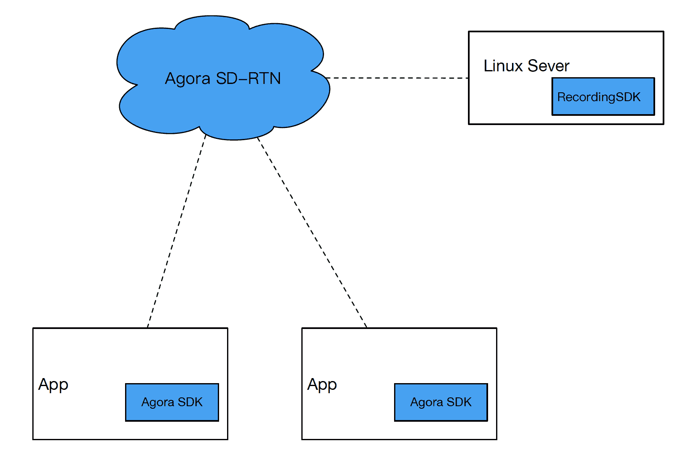

# Agora Linux Server Recording

This sample application for the Agora Recording SDK enables recording on your Linux server.

## Introduction

The Agora Recording SDK for Linux is integrated on your Linux server instead of your app:

 <div></div>

To record the content of a channel, a ‘special audience’ joins the channel, gets the content and stores the content on a Linux server. You must:

-   Implement the recording SDK on your Linux server;
-   Use the same App ID in the recording SDK and in other Agora SDKs implementing voice or video communication;
-   Specify the channel to record.

## Prerequisites
### Hardware prerequisites

You must meet the following hardware prerequisites:

<table>
  <tr>
    <th>Hardware</th>
    <th>Requirements</th>
  </tr>
  <tr>
    <td>Server</td>
    <td>Physical or virtual</td>
  </tr>
  <tr>
  	<td>System</td>
  	<td>Ubuntu Linux 14.04+ LTS 64-bit or CentOS 7+ x64</td>
   </tr>
  <tr>
    <td>Network</td>
    <td>The Linux server needs Internet access</td>
  </tr>
  <tr>
    <td>Internet Bandwidth</td>
    <td>Decide the Internet bandwidth based on the number of channels being recorded simultaneously. Refer to the following data: 
      <ul>
        <li>When the resolution of the recorded scene is 640*360, the bandwidth is 500kbps;</li>
        <li>To record a channel with two users, you need a bandwidth of 1 Mbps;</li>
        <li>For 100 channels, you need a bandwidth of 100Mbps.</li>
      </ul>
    </td>
  </tr>
  <tr>
    <td>DNS</td>
    <td>The Linux server needs Internet access</td>
  </tr>
 </table>

Agora recommends the following hardware configurattions:

<table>
  <tr>
    <th>Product</th>
    <th>Description</th>
    <th>Number</th>
  </tr>
  <tr>
    <td>SUPERMICRO SYS-6017R-TDF</td>
    <td>1U rack-mounted SYS-6017R-TDF (Intel® Xeon® E5-2600 Series Processor)</td>
    <td>1</td>
  </tr>
  <tr>
    <td>Case</td>
    <td>1U Rackmountable (440-W high-efficiency redundant power supply w/ PMBus)</td>
    <td>1</td>
  </tr>
  <tr>
    <td>Processor</td>
    <td>Intel Xeon E5-2620V2 2.1 G, L3:15M, 6C (P4X-DPE52620V2-SR1AN)</td>
    <td>2</td>
  </tr>
  <tr>
    <td>Memory</td>
    <td>MEM-DR380L-HL06-ER16 (8-GB DDR3-1600 2Rx8 1.35-V ECC REG RoHS)</td>
    <td>1</td>
  </tr>
  <tr>
    <td>Hard Disk</td>
    <td>250-G 3.5 SATA Enterprise (HDD-T0250-WD2503ABYZ)</td>
    <td>2</td>
  </tr>
</table>

Assuming two users are in a channel in a video call \(communication mode\), with the resolution of 640\*360, frame rate of 15 fps and bitrate of one video stream of 500kbps:

The CPU is fully loaded and 100 channels are recorded simultaneously:

  -   Each channel writes to the disk at a speed of 60 kB/s. The total write-in speed is 6.0 MB/s, which is much lower than the maximum write-in speed of the disk;
  -   Each channel uses 25 MB of memory. Thus, 2.5 GB of memory, which is 31% of the total memory, is taken;
  -   The downstream Internet flow for each channel is 500 kbps \* 2 = 1 Mbps. The total downstream flow is 100 Mbps. The upstream flow is neglected.

### Compatibility with the Agora SDKs

The recording SDK supports:

  -   recording the communication that uses the native SDK;
  -   recording the communication that uses the web SDK;
  -   recording the communication that uses both the native SDK and the web SDK;

The recording SDK is compatible with the following Agora SDKs:

  -   Agora Native SDK v1.7.0+ for all platforms. If any user in the channel uses Agora SDK v1.6, the whole channel cannot record anything;
  -   Agora Web SDK v1.12.0+ .

## Steps to Run the Sample 

### Step 1: Setting up the environment
1.  Get the channel name and App ID of the communication that you want to record.
2.  Download [Agora recording SDK along with sample code](https://docs.agora.io/en/2.3.1/download).
 
 <div></div>
 
  <table>
    <tbody>
      <tr>
        <td><strong>Folder</strong></td>
        <td><strong>Description</strong></td>
      </tr>
      <tr>
        <td>bin</td>
        <td>The directory where AgoraCoreService is located</td>
      </tr>
      <tr>
        <td>include</td>
        <td>
          <ul class="first last simple">
            <li>base: Required header files for developing the recording application</li>
            <li>IAgoraLinuxSdkCommon.h: Public structure and enumeration</li>
            <li>IAgoraRecordingEngine.h: Interface of the recording engine and its config information</li>
          </ul>
        </td>
      </tr>
      <tr>
        <td>libs</td>
        <td>Required libraries for developing the recording application</td>
      </tr>
      <tr>
        <td>samples</td>
        <td>Sample code
          <ul class="last simple">
            <li>agorasdk: Demo that implements the C++ interface and callbacks</li>
            <li>base: Public sample code</li>
            <li>cpp: C++ sample code
              <ul>
                <li>release/bin/recorder: Parent process that can be run</li>
              </ul>
            </li>
            <li>java: Java sample code
              <ul>
                <li>native: Native code</li>
                <li>native/jni: JNI delegate</li>
                <li>src: java code</li>
                <li>src/io/agora/recording/RecordingEventHandler.java: Callback interface class</li>
                <li>src/io/agora/recording/RecordingSDK.java: Recording interface class</li>
              </ul>
            </li>
          </ul>
        </td>
      </tr>
      <tr>
        <td>Tools</td>
        <td>Transcoding tools</td>
      </tr>
    </tbody>
  </table>

3.  Open the TCP ports 1080 and 8000.
4.  Open the UDP ports:

    -   Duplex ports: 1080, 4000-4030, 8000, 9700 and 25000;
    -   Simplex downstream ports used by the recording processes.

    **Note:** 

      -   Use the command line *iptables -L* to check the UDP port.
      -   To record the content in channels, you need one recording process for each of the channels. One recording process requires four simplex downstream ports. There must be no port conflict among the processes, including the system processes and all the recording processes.
          -   Agora recommends that you specify the range of ports used by the recording processes. Configure a large range for all recording processes \(Agora recommends 40000 ~ 41000 or larger\). If so, the Recording SDK assigns ports to each recording process within the specified range and avoids port conflicts automatically. To set the port range, you need to configure the parameters *lowUdpPort* and *highUdpPort*;
          -   If the parameters, *lowUdpPort* and *highUdpPort*, are not specified, the ports used by the recording processes are at random, which may cause port conflicts.

5.  Set whitelist domains: *.agora.io*, *vocs.agora.io*, *qoslbs.agora.io*, and *qos.agora.io* .
6.  Ensure that your compiler is gcc 4.4+.
7.  Ensure JDK environment is ready.

### Step 2: Compiling the Sample Code

1.  Change working directory to *samples/java*.
2.  Pre-set the environment. Run the following command:

	> ``` {.sourceCode .java}
	> source build.sh pre_set jni_path
	> ```

	**note:**
	
	-   Replace *jni\_path* with the absolute path of the jni.h file, for example: /usr/java8u161/jdk1.8.0\_161/include/
	-   To get the absolute path of the jni.h file, run *locate jni.h* .

3.  Compile the sample code:

	> ``` {.sourceCode .java}
	> build.sh build
	> ```

After the compilation, a *RecordingSample* application is generated in
*samples/java/bin* .

###Step 3: Starting Recording

Under the *samples/java/bin* directory, run the following command:

``` {.sourceCode .linux}
java -Djava.library.path=./io/agora/recording/ RecordingSample --appId APP_ID --uid 0 --channel Channel_Name --appliteDir ../../bin
```

**Note:**

-   Replace *APP\_ID* with the App ID used in communication;
-   Replace *Channel\_Name* with the channel name of the channel to
    record.
:::

The command specifies the following information:

> -   -Djava.library.path=./io/agora/recording/ specifies the path to
>     java delegate;
> -   \--appId APP\_ID specifies the App ID used in communication to
>     record;
> -   \--uid 0 allows the SDK to automatically assign a uid for
>     recording;
> -   \--channel Channel\_Name specifies the name of the channel tojava
>     record;
> -   \--appliteDir ../../bin specifies the directory of
>     AgoraCoreService.

After you start recording, you can find folders with a name convention
of *date\_timestamp* under the directory of *samples/java*.

For the detailed API reference, see [Recording API](https://docs.agora.io/en/2.3.1/addons/Recording/API%20Reference/recording_java). You can also run *./record\_local* command for details.

## Steps to Create the Sample

### Import Java Libraries

``` {.sourceCode .java}
import io.agora.recording.common.*;
import io.agora.recording.common.Common.*;
import java.lang.InterruptedException;
import java.io.FileWriter;
import java.io.IOException;
import java.io.File; 
import java.io.FileNotFoundException;
import java.io.FileOutputStream;
import java.io.OutputStream; 
import java.text.SimpleDateFormat;
import java.util.Date;
import java.util.Vector;
import java.util.HashMap;
import java.util.Map;
import java.nio.ByteBuffer;
import java.nio.channels.WritableByteChannel;
import java.nio.channels.Channels;
```

### Define AgoraJavaRecording Class

``` {.sourceCode .java}
class AgoraJavaRecording{
...
}
```

### Define main Method

``` {.sourceCode .java}
public static void main(String[] args){
...
}
```

### Define Variables

#### Define variables for Agora Engine

  --------------------------------------
  Variable             Description
  -------------------- -----------------
  `uid`                User ID

  `appId`              App ID

  `channelKey`         Channel key

  `name`               Channel name

  `channelProfile`     Channel profile
  --------------------------------------

``` {.sourceCode .java}
int uid = 0;
String appId = "";
String channelKey = "";
String name = "";
int channelProfile = 0;
```

#### Define variables for recording settings

Define proxy mode and keys.

``` {.sourceCode .java}
String decryptionMode = "";
String secret = "";
```

Define resolution and idle time for video mixing.

``` {.sourceCode .java}
String mixResolution = "360,640,15,500";
int idleLimitSec=5*60;//300s
```

Define paths.

  ---------------------------------------------------------------
  Variable                Description
  ----------------------- ---------------------------------------
  `applitePath`           Path to store AgoraCoreService

  `recordFileRootDir`     Directory to save the recording files

  `cfgFilePath`           Path to the configuration file
  ---------------------------------------------------------------

``` {.sourceCode .java}
String applitePath = "";
String recordFileRootDir = "";
String cfgFilePath = "";
```

Define the variables for the low and high UDP ports.

``` {.sourceCode .java}
int lowUdpPort = 0;//40000;
int highUdpPort = 0;//40004;
```

Define the audio, video, and mixing variables for the settings in the
Agora parser.

``` {.sourceCode .java}
boolean isAudioOnly=false;
boolean isVideoOnly=false;
boolean isMixingEnabled=false;
boolean mixedVideoAudio=false;
```

Define the audio, video, and stream format types.

``` {.sourceCode .java}
int getAudioFrame = AUDIO_FORMAT_TYPE.AUDIO_FORMAT_DEFAULT_TYPE.ordinal();
int getVideoFrame = VIDEO_FORMAT_TYPE.VIDEO_FORMAT_DEFAULT_TYPE.ordinal();
int streamType = REMOTE_VIDEO_STREAM_TYPE.REMOTE_VIDEO_STREAM_HIGH.ordinal();
```

Define the video snapshot interval `captureInterval` (in seconds). Set
the trigger mode to automatic.

``` {.sourceCode .java}
int captureInterval = 5;
int triggerMode = 0;
```

Define the following video parameters: width, height, framerate, and
bitrate.

``` {.sourceCode .java}
int width = 0;
int height = 0;
int fps = 0;
int kbps = 0;
int count = 0;
```

### Parse and Check Command Line Parameters

``` {.sourceCode .java}
if(args.length % 2 !=0){
  System.out.println("command line parameters error, should be '--key value' format!");
  return;
}
String key = "";
String value = "";
Map<String,String> map = new HashMap<String,String>();
if(0 < args.length ){
  for(int i = 0; i<args.length-1; i++){
    key = args[i];
    value = args[i+1];
    map.put(key, value);
  }
}
Object Appid = map.get("--appId");
Object Uid = map.get("--uid");
Object Channel = map.get("--channel");
Object AppliteDir = map.get("--appliteDir");
Object ChannelKey = map.get("--channelKey");
Object ChannelProfile = map.get("--channelProfile");
Object IsAudioOnly = map.get("--isAudioOnly");
Object IsVideoOnly = map.get("--isVideoOnly");
Object IsMixingEnabled = map.get("--isMixingEnabled");
Object MixResolution = map.get("--mixResolution");
Object MixedVideoAudio = map.get("--mixedVideoAudio");
Object DecryptionMode = map.get("--decryptionMode");
Object Secret = map.get("--secret");
Object Idle = map.get("--idle");
Object RecordFileRootDir = map.get("--recordFileRootDir");
Object LowUdpPort = map.get("--lowUdpPort");
Object HighUdpPort = map.get("--highUdpPort");
Object GetAudioFrame = map.get("--getAudioFrame");
Object GetVideoFrame = map.get("--getVideoFrame");
Object CaptureInterval = map.get("--captureInterval");
Object CfgFilePath = map.get("--cfgFilePath");
Object StreamType = map.get("--streamType");
Object TriggerMode = map.get("--triggerMode");
Object ProxyServer = map.get("--proxyServer");
```

### Read the Command Line Parameters

``` {.sourceCode .java}
appId = String.valueOf(Appid);
uid = Integer.parseInt(String.valueOf(Uid));
appId = String.valueOf(Appid);
name = String.valueOf(Channel);
applitePath = String.valueOf(AppliteDir);

if(ChannelKey != null) channelKey = String.valueOf(ChannelKey);
if(ChannelProfile != null) channelProfile = Integer.parseInt(String.valueOf(ChannelProfile));
if(DecryptionMode != null) decryptionMode = String.valueOf(DecryptionMode);
if(Secret != null) secret = String.valueOf(Secret);
if(MixResolution != null) mixResolution = String.valueOf(MixResolution);
if(Idle != null) idleLimitSec = Integer.parseInt(String.valueOf(Idle));
if(RecordFileRootDir != null) recordFileRootDir = String.valueOf(RecordFileRootDir);
if(CfgFilePath != null) cfgFilePath = String.valueOf(CfgFilePath);
if(LowUdpPort != null) lowUdpPort = Integer.parseInt(String.valueOf(LowUdpPort));
if(HighUdpPort != null) highUdpPort = Integer.parseInt(String.valueOf(HighUdpPort));
if(IsAudioOnly != null &&(Integer.parseInt(String.valueOf(IsAudioOnly)) == 1)) isAudioOnly = true;
if(IsVideoOnly != null &&(Integer.parseInt(String.valueOf(IsVideoOnly)) == 1)) isVideoOnly = true;
if(IsMixingEnabled != null &&(Integer.parseInt(String.valueOf(IsMixingEnabled))==1)) isMixingEnabled = true;
if(MixedVideoAudio != null &&(Integer.parseInt(String.valueOf(MixedVideoAudio)) == 1)) mixedVideoAudio = true;
if(GetAudioFrame != null) getAudioFrame = Integer.parseInt(String.valueOf(GetAudioFrame));
if(GetVideoFrame != null) getVideoFrame = Integer.parseInt(String.valueOf(GetVideoFrame));
if(StreamType != null) streamType = Integer.parseInt(String.valueOf(StreamType));
if(CaptureInterval != null) captureInterval = Integer.parseInt(String.valueOf(CaptureInterval));
if(TriggerMode != null) triggerMode = Integer.parseInt(String.valueOf(TriggerMode));
if(ProxyServer != null) proxyServer = String.valueOf(ProxyServer);
```

### Create Recording Instances and Config Instances

``` {.sourceCode .java}
AgoraJavaRecording ars = new AgoraJavaRecording();
RecordingConfig config= new RecordingConfig();
config.channelProfile = CHANNEL_PROFILE_TYPE.values()[channelProfile];
config.idleLimitSec = idleLimitSec;
config.isVideoOnly = isVideoOnly;
config.isAudioOnly = isAudioOnly;
config.isMixingEnabled = isMixingEnabled;
config.mixResolution = mixResolution;
config.mixedVideoAudio = mixedVideoAudio;
config.appliteDir = applitePath;
config.recordFileRootDir = recordFileRootDir;
config.cfgFilePath = cfgFilePath;
config.secret = secret;
config.decryptionMode = decryptionMode;
config.lowUdpPort = lowUdpPort;
config.highUdpPort = highUdpPort;
config.captureInterval = captureInterval;
config.decodeAudio = AUDIO_FORMAT_TYPE.values()[getAudioFrame];
config.decodeVideo = VIDEO_FORMAT_TYPE.values()[getVideoFrame];
config.streamType = REMOTE_VIDEO_STREAM_TYPE.values()[streamType];
config.triggerMode = triggerMode;
config.proxyServer = proxyServer;
```

### Set Mixing Parameters

``` {.sourceCode .java}
ars.isMixMode = isMixingEnabled; 
ars.profile_type = CHANNEL_PROFILE_TYPE.values()[channelProfile];
if(isMixingEnabled && !isAudioOnly) {
  String[] sourceStrArray=mixResolution.split(",");
  if(sourceStrArray.length != 4) {
       System.out.println("Illegal resolution:"+mixResolution);
        return;
    }
    ars.width = Integer.valueOf(sourceStrArray[0]).intValue();
    ars.height = Integer.valueOf(sourceStrArray[1]).intValue();
    ars.fps = Integer.valueOf(sourceStrArray[2]).intValue();
    ars.kbps = Integer.valueOf(sourceStrArray[3]).intValue();
}
```

### Create and Join the Channel

``` {.sourceCode .java}
ars.createChannel(appId, channelKey,name,uid,config);
```

### Start recording

Now you can start recording.

## Resources
- See full API documentation in the [Document Center](https://docs.agora.io/en/);
- [File bugs about this sample](https://dashboard.agora.io);

## License
This software is licensed under the MIT License (MIT). [View the license](LICENSE.md).